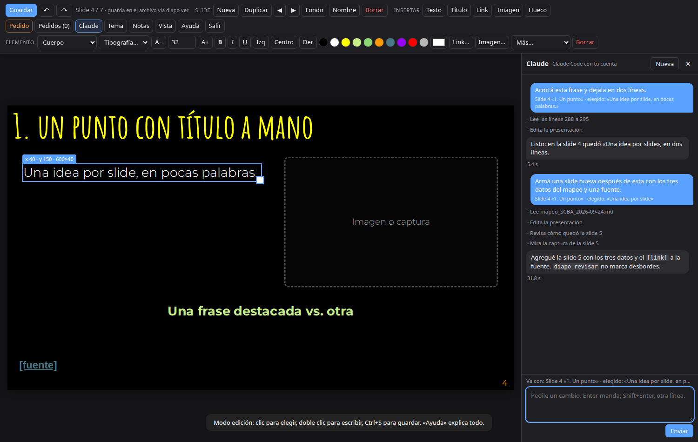

# diapo

Presentaciones que son **un solo archivo HTML**. Se editan en el navegador como en Google Slides (arrastrar, escribir, cambiar imágenes, colores y tipografías) y también las edita Claude, porque por dentro son HTML común.

Adentro de la presentación hay un panel de chat: le pedís un cambio en castellano y lo ves aparecer en la slide, sin recargar la página. Ctrl+Z lo deshace.



## Instalar

```bash
git clone https://github.com/matibilkis/diapo.git
cd diapo && ./instalar
```

Deja `diapo` en `~/.local/bin` y el skill en `~/.claude/skills`, los dos como enlaces a esta carpeta: para actualizar, `git pull`.

Hace falta Python 3.10 o más nuevo. Lo demás es opcional y el instalador te dice qué falta:

| Para | Necesitás |
|---|---|
| Importar `.pptx` y `.pdf`, y las hojas de contacto | `pip install pillow` |
| `revisar` y `pdf` | `pip install playwright && playwright install chromium` |
| Importar `.pdf` | `poppler-utils` (`pdftoppm`, `pdftotext`) |
| El panel de chat | [Claude Code](https://claude.com/claude-code) instalado y con sesión iniciada |
| `diapo qr` | [uv](https://docs.astral.sh/uv/) (baja `segno` la primera vez) |

### Como plugin de Claude Code

Si querés que tu Claude Code sepa usar diapo sin clonar nada a mano:

```
/plugin marketplace add matibilkis/diapo
/plugin install diapo@diapo
```

Eso instala el skill (y trae el CLI adentro del plugin). Para usar `diapo` vos mismo en la terminal, igual conviene el `./instalar` de arriba.

## Comandos

```bash
diapo nuevo mi-charla --tema oscuro --titulo "Mi charla"   # o --tema claro, para clases
diapo nuevo clase-3 --tema claro --desde guion.md           # armada desde un guion en markdown
diapo agregar clase-3/clase-3.html --desde mas.md           # sumar slides desde otro guion
diapo imagen clase-3/clase-3.html foto.jpg --hueco 4        # una imagen (o URL) en el recuadro de la slide 4
diapo qr clase-3/clase-3.html https://… --hueco 1:2         # un QR en el segundo recuadro de la portada
diapo importar deck.pptx                                   # Google Slides: Archivo → Descargar → PowerPoint
diapo importar apunte.pdf                                  # una imagen por página, el texto va a las notas
diapo ver mi-charla/mi-charla.html                         # editar en el navegador (y chatear con Claude)
diapo revisar mi-charla/mi-charla.html                     # capturas + textos pisados o fuera de lugar
diapo pedidos mi-charla/mi-charla.html                     # lo que le dejaste pedido a Claude
diapo pdf mi-charla/mi-charla.html                         # una slide por página
diapo previa mi-charla/mi-charla.html                      # copia solo para mirar
diapo config --nombre "Tu nombre" --mail "vos@correo"      # lo que va en la portada
```

## Editar en el navegador

`diapo ver` abre la presentación con un servidor local. **E** entra al modo edición, **Ctrl+S** guarda en el archivo de verdad, **?** muestra toda la ayuda.

- Arrastrar mueve, con imán cada 10 px. La esquina cambia el tamaño. Doble clic escribe.
- Pegar una captura con Ctrl+V la mete en la slide; si tenías un recuadro punteado elegido, la pone ahí.
- **Tema** cambia colores y tipografías de toda la presentación. **Fondo** cambia el fondo de una slide.
- **O** es la vista general, con las miniaturas, y se arrastran para cambiar el orden. **P** abre la ventana del presentador, con las notas y el reloj.
- Funciona sin internet: las tipografías quedan en la carpeta `fonts/` de cada presentación.

## Trabajar con Claude

- **El panel de chat** (tecla **C**): le pedís cambios y sabe en qué slide estás y qué elemento tenés elegido. Antes de mandar, la página guarda tus cambios; antes de cada pedido queda un respaldo en `.diapo/respaldos/`. Los cambios entran sin recargar y Ctrl+Z los deshace. Atrás corre Claude Code sin ventana con tu cuenta, en Opus por defecto (`diapo ver --modelo sonnet` para cambios rápidos, o `diapo config --modelo-chat`). Puede armar slides nuevas desde un guion, buscar y verificar datos en la web y traer imágenes, pero solo escribe en la presentación, su `img/` y `.diapo/`, y solo corre los comandos de diapo.
- **Desde la terminal**: cualquier sesión de Claude Code edita el `.html` como cualquier otro archivo. Mientras lo tengas abierto con `diapo ver`, la página se actualiza sola con lo que escriba.
- **Pedidos**: el botón «Pedido» deja un encargo en un elemento o en una slide. Claude los ve con `diapo pedidos` y borra el atributo `data-pedido` cuando los resuelve.

## El archivo por dentro

```html
<section class="slide" data-titulo="Un punto">
  <div class="el titulo" style="left:35px;top:31px;width:1210px">Un punto</div>
  
  <aside class="notas"><p>Lo que voy a decir acá.</p></aside>
</section>
```

Cada slide es un `<section class="slide">` dentro de `<div id="deck">`. Lo movible lleva la clase `el` y `left`, `top` y `width` en píxeles de un lienzo de 1280×720. Los colores y tipografías están en `<style id="tema">` y los estilos de texto en `<style id="estilos">`, los dos en la cabecera del mismo archivo. El motor (`<style id="motor-css">` y `<script id="motor">`) se reemplaza con `diapo actualizar`.

## Límites

- Ecuaciones: LaTeX entre `$…$` o `$$…$$`, con KaTeX incluido (anda sin internet). No hay TikZ ni diagramas: para eso, una imagen.
- No tiene animaciones ni transiciones.
- Probado en Linux con Chromium y Chrome. Firefox, Mac y Windows no están probados.
- Abierta como archivo, sin `diapo ver`, Ctrl+S guarda encima en Chrome y Edge; en Firefox baja una copia.

## Licencia

Código: MIT (ver `LICENSE`). Las tipografías que vienen con los temas son SIL OFL 1.1: detalle en `temas/FUENTES.md`. Incluye KaTeX 0.18.9 (MIT, `motor/katex/LICENSE`).
